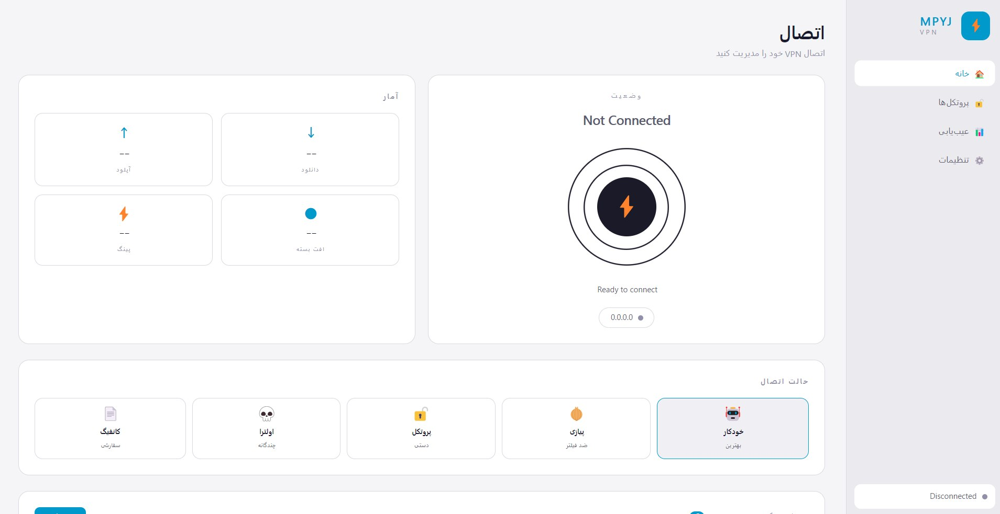
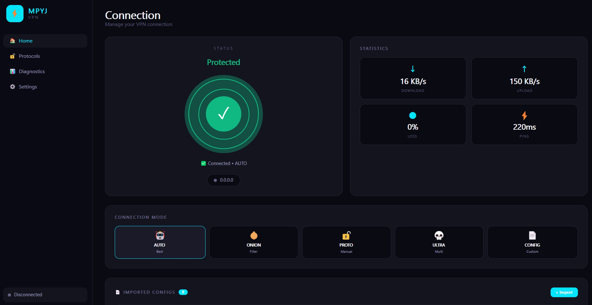
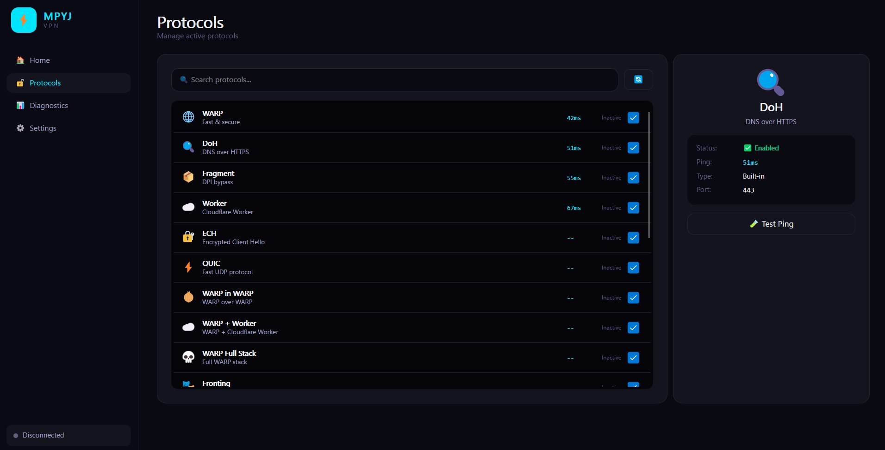
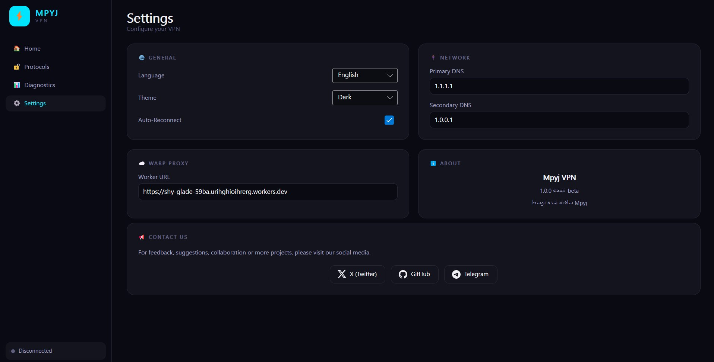
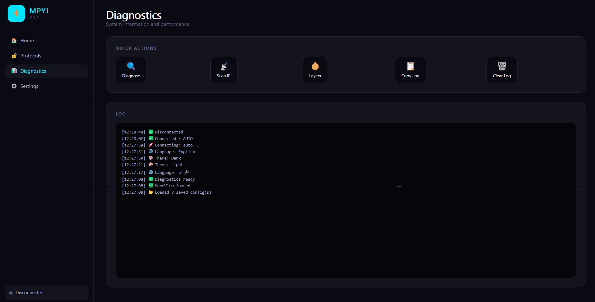

# MpyjVPN

<p align="center">
  <strong>یک کلاینت VPN سریع، امن و مدرن</strong><br>
  یک VPN کلاینت مدرن و چندسکویی ساخته‌شده با C# و Avalonia
</p>

<p align="center">
  <a href="README.md">🇬🇧 English Version</a>
</p>

<p align="center">
  
  
  
  
</p>

MpyjVPN یک کلاینت VPN مدرن و چندسکویی است که با معماری تمیز، رابط کاربری حرفه‌ای و سیستم انعطاف‌پذیر پروتکل‌ها و کانفیگ‌ها طراحی شده است.

این پروژه روش‌های مختلف اتصال، امکان وارد کردن کانفیگ، ابزارهای Diagnostics، مدیریت DNS، نمایش اطلاعات لحظه‌ای اتصال و یک تجربه مدرن دسکتاپ را در یک برنامه جمع می‌کند.

---

## 📸 تصاویر پروژه

### صفحه اصلی



### اتصال برقرار است



### پروتکل‌ها



### تنظیمات



### Diagnostics



---

## ✨ امکانات

### 🌐 پروتکل‌های داخلی

MpyjVPN شامل **۱۴ پروتکل و تکنیک داخلی** است:

- WARP
- DoH
- Fragment
- Worker
- Google Proxy
- ECH
- QUIC
- ICMP
- WebSocket
- Domain Fronting
- Multi-hop
- DNS Tunnel
- IP Spoof
- SNI Spoof

### 🔀 حالت‌های اتصال

برنامه دارای **۷ حالت اتصال** است:

- Auto
- Onion
- Protocols
- Ultra
- WARP-in-WARP
- WARP+Worker
- Full Stack

موتور اتصال می‌تواند لایه‌ها و تکنیک‌های مختلف را در قالب Stackهای انعطاف‌پذیر ترکیب کند.

### 🧩 سیستم اتصال پیشرفته

- **۱۸ لایه Stack**
- WARP-in-WARP
- اتصال‌های Multi-Hop
- اتصال مجدد خودکار
- نمایش اطلاعات لحظه‌ای اتصال
- نمایش Ping و Packet Loss
- IP Scanner
- مدیریت DNS

### 📥 وارد کردن کانفیگ

امکان وارد کردن کانفیگ از منابع مختلف:

- VMess
- VLess
- Trojan
- Shadowsocks
- JSON
- Subscription URL
- Subscriptionهای Base64
- وارد کردن خودکار از Clipboard

### 🎨 رابط کاربری مدرن

- تم تاریک و روشن
- پشتیبانی از فارسی و RTL
- پشتیبانی از انگلیسی
- System Tray
- Toast Notification
- انیمیشن PowerOrb
- افکت Particle Canvas
- رابط کاربری تمیز و واکنش‌گرا

### 🛠️ ابزارهای توسعه و Diagnostics

- `LogService` مشترک
- Diagnostics
- مدیریت Settings
- `MpyjCLI`
- معماری ساختاریافته پروژه

---

## 🖥️ پلتفرم‌های پشتیبانی‌شده

در حال حاضر نسخه‌های Self-contained برای پلتفرم‌های دسکتاپ زیر ارائه می‌شوند:

| پلتفرم | معماری |
|---|---|
| Windows | x64 |
| Linux | x64 |
| Linux | ARM64 |
| macOS | Intel |
| macOS | ARM64 |

> نسخه‌های موبایل برای انتشارهای آینده در نظر گرفته شده‌اند.

---

## 📦 دانلود

آخرین نسخه از طریق بخش GitHub Releases پروژه در دسترس قرار می‌گیرد.

### v1.0.0-beta

نسخه‌های Self-contained برای پلتفرم‌های دسکتاپ پشتیبانی‌شده ارائه می‌شوند؛ بنابراین برای اجرای نسخه منتشرشده نیازی به نصب جداگانه .NET نیست.

---

## 🏗️ معماری پروژه

MpyjVPN از **Clean Architecture** استفاده می‌کند و به شش پروژه اصلی تقسیم شده است:

```text
MpyjVPN/
├── src/
│   ├── MpyjVPN.Domain
│   ├── MpyjVPN.Core
│   ├── MpyjVPN.Infrastructure
│   ├── MpyjVPN.Application
│   ├── MpyjVPN.Avalonia
│   └── MpyjVPN.CLI
├── assets/
│   └── screenshots/
├── docs/
├── README.md
└── README.Fa.md
```

### لایه‌های پروژه

| پروژه | مسئولیت |
|---|---|
| **Domain** | مدل‌ها، Enumها و Interfaceها |
| **Core** | موتور VPN، پروتکل‌ها و سرویس‌های اصلی |
| **Infrastructure** | Parserهای کانفیگ و Storage |
| **Application** | ViewModelها، سرویس‌های برنامه و منطق کسب‌وکار |
| **Avalonia** | رابط کاربری دسکتاپ |
| **CLI** | رابط خط فرمان و ابزارهای توسعه |

---

## 🧰 تکنولوژی‌ها

- **C# 13**
- **.NET 10**
- **Avalonia 11.2.1**
- Clean Architecture
- NuGet
- `dotnet` CLI
- GitHub Actions
- Inno Setup
- `dotnet format`
- CodeQL
- Tmds.DBus.Protocol

---

## 🚀 ساخت پروژه از سورس

### پیش‌نیاز

مطمئن شوید SDK موردنیاز .NET روی سیستم شما نصب است.

### دریافت پروژه

```bash
git clone https://github.com/Mpyj/MpyjVPN.git
cd MpyjVPN
```

### دریافت وابستگی‌ها

```bash
dotnet restore
```

### Build

```bash
dotnet build -c Release
```

### اجرای نسخه دسکتاپ

```bash
dotnet run --project src/MpyjVPN.Avalonia
```

### انتشار

#### Windows x64

```bash
dotnet publish src/MpyjVPN.Avalonia -c Release -r win-x64 --self-contained true
```

#### Linux x64

```bash
dotnet publish src/MpyjVPN.Avalonia -c Release -r linux-x64 --self-contained true
```

#### macOS ARM64

```bash
dotnet publish src/MpyjVPN.Avalonia -c Release -r osx-arm64 --self-contained true
```

---

## 🗺️ نقشه راه

### v1.0.0-beta

- قابلیت‌های اصلی VPN
- پروتکل‌های داخلی
- وارد کردن کانفیگ
- Diagnostics
- رابط کاربری دسکتاپ
- نسخه‌های دسکتاپ چندسکویی

### v1.1.0

- پکیج Linux با فرمت `.deb`
- پکیج macOS با فرمت `.dmg`
- Code Signing
- Auto-update
- پشتیبانی از SOCKS5 / HTTP Proxy

### v2.0.0

- Android
- iOS
- Web Dashboard
- سیستم Plugin

> نقشه راه ممکن است در طول توسعه پروژه تغییر کند.

---

## 🤝 مشارکت

از مشارکت، ایده‌ها، گزارش باگ و پیشنهادهای شما استقبال می‌شود.

اگر مشکلی پیدا کردید یا ایده‌ای برای بهتر شدن MpyjVPN دارید، می‌توانید Issue ایجاد کنید یا Pull Request ارسال کنید.

---

## 📄 مجوز

MpyjVPN تحت **MIT License** منتشر شده است.

برای متن کامل مجوز، فایل `LICENSE` را مشاهده کنید.

---

## 🌐 ارتباط با Mpyj

<p>
  <a href="https://x.com/Mpyj_X">𝕏 X</a> ·
  <a href="https://t.me/MpyjTelegram">✈️ Telegram</a>
</p>

---

<p align="center">
  <strong>MpyjVPN</strong><br>
  Built by Mpyj
</p>
